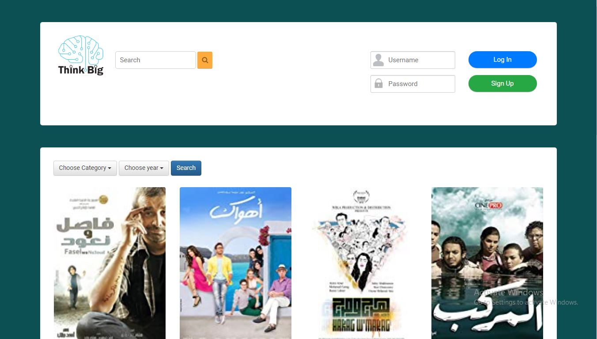
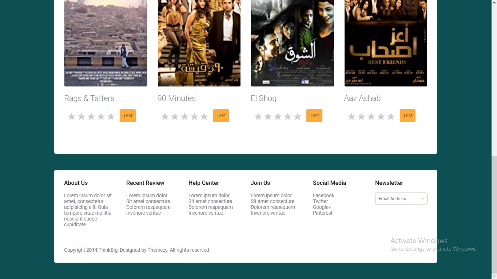

# Movie Recommendations Fe Assignment

## Features supported by the front end 
As can be seen from the image below the features included are: 
 - Header Section
   - Added Container for Header Section.
   - Visitor will enter his Username and Password to Log in or he can press on Sign up to make account on this site.
   - Visitor can search for a movie (left search panel)
 - Movies Section  
   - Visitor can filter the movies by year or type (left drop down lists) and It implemented as checkboxes(using jQuery)
   - Visitor can get the next batch of movies and Previous batch of movies(by 2 buttons putted under movie list). 
   - For each movie
     - Visitor can provide a rating .
     - Visitor can ask us to provide him "his learned rating".
 - Footer Section
   - Visitor will Know about Different Things:
     - About Us.
     - Recent Review.
     - Help Center
     - Our Pages on Different Social Media
   - Visitor Can Write His Email to send new news to him

  
  

##Have Fun
